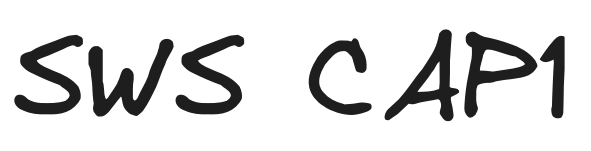
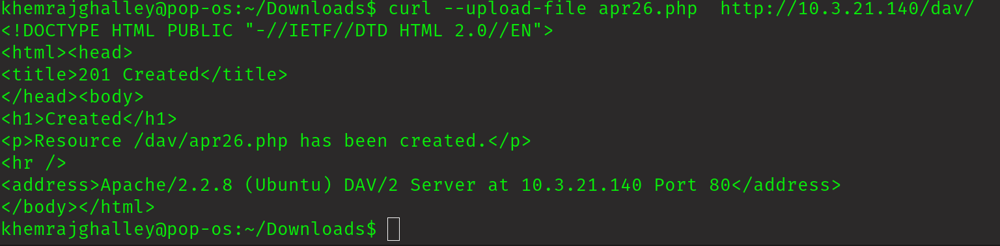
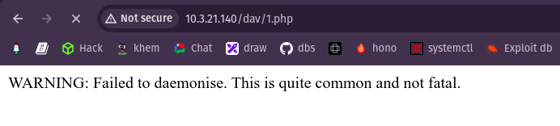
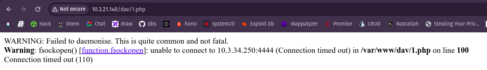
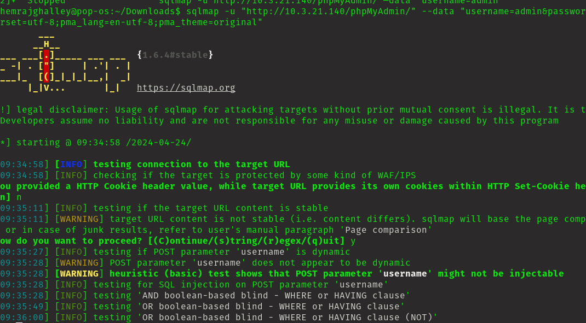
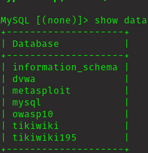
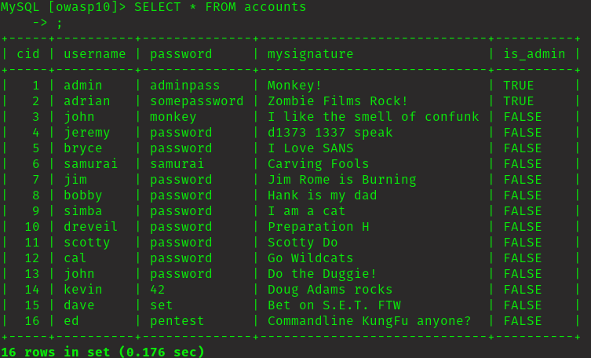
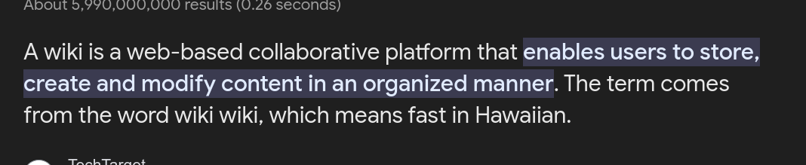
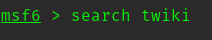
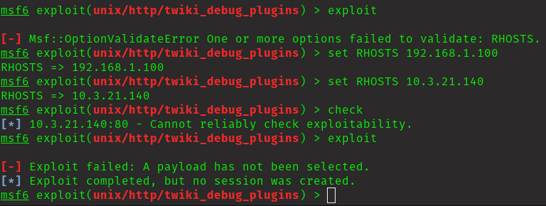

# Execute Summary
This machine is hosted for our Software Security module for assignment 1. The machine has many port open and we have to exploit it using the vulnerabilities present in the services running on the machine. The machine has web server running on port 80 which has login page in specific directory. The machine has FTP server running on port 21 which has user login enabled. The machine has SSH server running on port 22 which has authenticated based login. The machine has MySQL server running on port 3306 which was able to login using the specific command and I could see all the data in the database. There were many port open for the exploits. First of all I tried for reverse shell using the web server but unfortunately I could get the resverse shell though I could upload the php file on the web directory. 

## Github Repo Link

[link to github repo](https://github.com/Khemraj9815/SWS101/tree/main/SWS)

# Approach

## Assessment Overview and Recommendations

During the penetration test on machine of the ip address 10.3.21.140, I could not find  exploits other than port 3306(mysql) though all the ports were vulnerable because of outdated version of the application. But I have tried a lots of stuff to find the vulnerablities.

I found out that I was able to upload reverse shell file in one of the directory and I could even run the file which can lead closer to exploitation. This behaviour of uploading file should not be allowed. It is not just on the http directories but also on the ftp port I could add file, unfortunately ftp port(21) was not accessable on http. This behaviour save the machine from exploitation. If ftp port(21) was accessable from http server there coluld be high chances of exploits. The above behaviour of the ports mentioned above is the dangerous because the attacker can upload anything they could to gain unauthorised access. 

Other thing is, database of the system was visible or accessable and could inspect all the data that was inside the database which is on port 3306(mysql). It was possible with just one line of command and I was in. I could run all the that was needed to run. I think this behaviour of mysql port is unusual because this coluld lead to loss ot sensetives informations. 

This is about the twiki, I dont't know whether the website has used twiki or not, but if it has used twiki for their benefits. Which enable user to upload files on it and share it to other. I see this as a weak spot or the tatget spot  for the attacker to upload files which can lead closer to exploitation of sensetive informations. 

This is positive side of the webpage that it had a login form where only the adminstrative user are authorised. If website have a login form, it should be carefully designed so that it is not sql injectable which can lead attacker to sensitive informations. Lucily the login form was not injectable.

# Network Penetration Test Assessment Summary

This penetration testing is for the assement of Software Security module test the capabilities of us to exploit the machine with ip address 10.3.21.140

## Detailed Walkthrough

I have tried everything that I have learned or I could think of to exploit the machine. I have tried to exploit the machine using the following ways:

### Reverse shell on web server

I tried uploading file on randon directories, fortunately I was able to upload the file that I want to. After successflly uoloading file(reverse shell file) and I was able to run the file but I couldn't get response. 

### SQLmap in login page for command injection

After seeing the login form command injection came to my mind and gave a try for it using sqlmap since it is used for commad injection. 

It should give me the command line where I can paste in login form to break the barrier.

### FTP server for uploading the file

I guessed the username and the password as "user" to login to ftp. Login was successful and I was able to upload file. Since ftp port(21) was not accessable from http I was no able to run the file that I have uploaded in ftp port.

### mysql for getting the data from the database

I was able to get inside the mysql port and even access all the database present inside the system. Though I found those information I didn't find it useful anywhere. 

### Twiki

So I started searching the exploits of twiki, I tred exploiting using metasploit.

# Remediation Summary

The target machine has many vulnerable ports open which can lead to exploitation. The vulnerabilties was based on the its outdated version of application. The main thing that I found was, attacker can upload file on the web server and ftp server which can lead close to exploitation of the machine. Those behaviour should not be expose to the attacker or we should not give any chance to start attacker to attack. The best way to prevent from every vulnerablities is to keep all the application upto latest version. 
